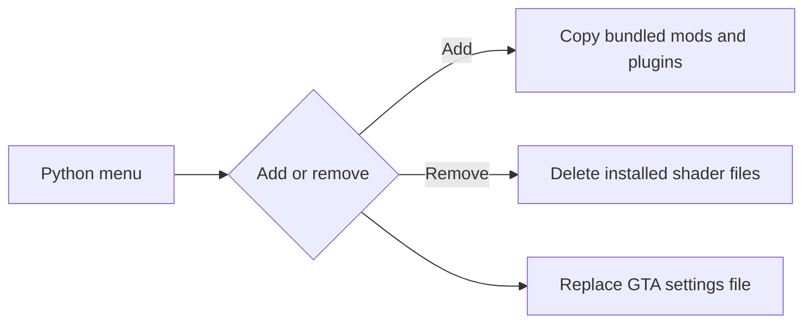

# FiveM Shaders Toggle

[](https://github.com/KeyErrorFinn/fivem-shaders-toggle/commits/main) [](https://github.com/KeyErrorFinn/fivem-shaders-toggle/issues)

A Windows command-line utility for installing or removing a bundled FiveM graphics/shader setup and switching between matching GTA V settings files.

## Warning

This tool performs destructive file operations inside your FiveM installation:

- Removing shaders deletes everything in FiveM's `plugins` directory.
- It deletes everything in `mods` except `sculpture_revival.rpf`.
- It overwrites `%APPDATA%\CitizenFX\gta5_settings.xml`.

Back up those locations before using it. Review the bundled third-party files and their licences yourself.

## How it works

`toggle_shaders.py` locates FiveM under `%LOCALAPPDATA%\FiveM\FiveM.app` and presents three choices:

1. Copy `files/mods` and `files/plugins` into FiveM, then apply the high settings file.
2. remove the installed shader/plugin files, preserving only `sculpture_revival.rpf`, then apply the low settings file.
3. Open the FiveM application directory in File Explorer.

## Running

Requires Windows and Python 3:

```powershell
python toggle_shaders.py
```

For a shortcut, copy `Toggle FiveM Shaders.example.bat`, replace its placeholder with this repository's absolute directory, and run the copy.

## Project structure

- `toggle_shaders.py` — installer/remover and menu.
- `files/configs/high` and `files/configs/low` — GTA settings applied for each mode.
- `files/mods` and `files/plugins` — files copied into FiveM.

<!-- documentation-extras -->

## Project flow



<details>
<summary>Documentation and maintenance notes</summary>

- Commands and behaviour in this README are derived from the files currently committed to the repository.
- External services, games, websites, browser APIs, and file formats can change independently of this project.
- When reporting a problem, include the operating system, runtime version, exact command, and complete error text with secrets removed.

</details>

## Contributing

Focused fixes are welcome. Before changing behaviour, open an issue describing the problem and intended result. Keep credentials, generated secrets, personal data, and machine-specific configuration out of commits. Update this README whenever commands, configuration, paths, or supported behaviour change.

## Licence

No project-level licence is currently declared in this repository. Copyright remains with the repository owner and other contributors; obtain permission before redistributing or incorporating the code elsewhere. Third-party assets and dependencies retain their own licences.
