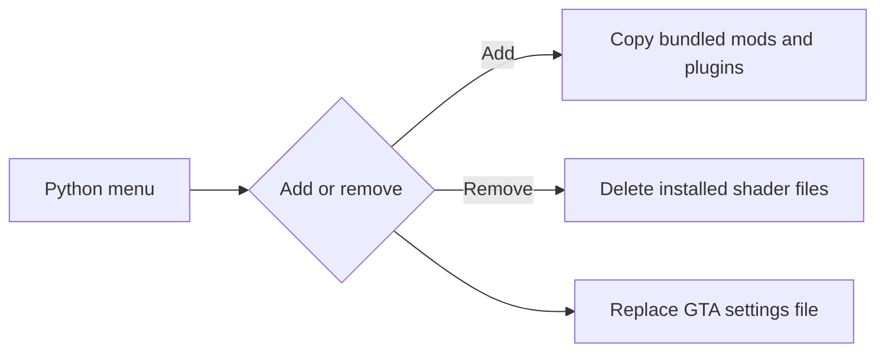

# FiveM Shaders Toggle

<p align="center">
  <a href="https://github.com/KeyErrorFinn/fivem-shaders-toggle/commits/main"></a>
  <a href="https://github.com/KeyErrorFinn/fivem-shaders-toggle/issues"></a>
</p>

<p align="center">
  
  
  
</p>

A Windows command-line utility for installing or removing a bundled FiveM graphics/shader setup and switching between matching GTA V settings files.

## Warning

This tool performs destructive file operations inside your FiveM installation:

- Removing shaders deletes everything in FiveM's `plugins` directory.
- It deletes everything in `mods` except `sculpture_revival.rpf`.
- It overwrites `%APPDATA%\CitizenFX\gta5_settings.xml`.

Back up those locations before using it. Review the bundled third-party files and their licences yourself.

## How it works

`toggle_shaders.py` locates FiveM under `%LOCALAPPDATA%\FiveM\FiveM.app` and presents three choices:

1. Copy `files/mods` and `files/plugins` into FiveM, then apply the high settings file.
2. remove the installed shader/plugin files, preserving only `sculpture_revival.rpf`, then apply the low settings file.
3. Open the FiveM application directory in File Explorer.

## Running

Requires Windows and Python 3:

```powershell
python toggle_shaders.py
```

For a shortcut, copy `Toggle FiveM Shaders.example.bat`, replace its placeholder with this repository's absolute directory, and run the copy.

## Project structure

- `toggle_shaders.py`  -  installer/remover and menu.
- `files/configs/high` and `files/configs/low`  -  GTA settings applied for each mode.
- `files/mods` and `files/plugins`  -  files copied into FiveM.

## Project flow


